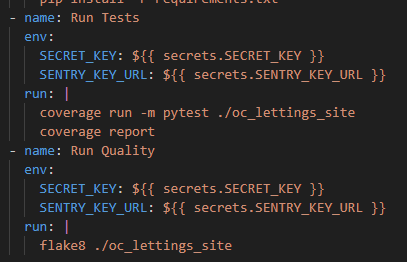
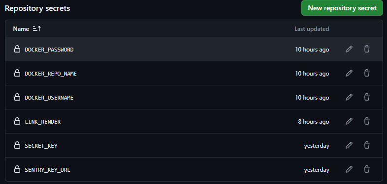

Deployment
==========

Here we'll describe a step-by-step guide in order to deploy your application to the cloud

GitHub Actions
--------------

This part is where CI and launch CL are done

In fact, you can refer to the .github/workflows/django.yml to see workflows and jobs done

django-test-and-quality
~~~~~~~~~~~~~~~~~~~~~~~

This job is used to launch *flake8* for quality and unit test with *coverage*.

Here you can see some {{ secrets.variables }}

This mean you need to initialize those in GitHub

This is where the **fork** is important
    * Go to your repository
    * Open Settings
    * Extend on Secrets and variables
    * Click on Actions
    * Scroll down to Repository secrets

Then enter all variables present below

Values
    * DOCKER_PASSWORD : The password of your Docker Account
    * DOCKER_REPO_NAME : The repository name of your Docker Container *See build-and-push-docker below*
        For example in r0b1ndock/p13_oc, the name is **p13_oc**
    * DOCKER_USERNAME : The username of your Docker Account
    * LINK_RENDER : *See Render part below* 
    * SECRET_KEY : The Secret Key present in your .env file
    * SENTRY_KEY_URL : The URL link from sentry_sdk also present in your .env file

With those informations, we can continue the breakdown

In order to end this job, GitHub Action will now install python, install your requirements.txt and then launch and tests and qualities features. Such as
flake8 or coverage. 

build-and-push-docker
---------------------

Create Docker repository on your DockerHub Account

The name given goes here in your repository secrets **DOCKER_REPO_NAME**

This job build your project using Dockerfile, then push it to your DockerHub Account

.. note::
    This job is launched only if *django-test-and-quality* is OK

Render **deploy-render**
------------------------

Actually deployed to `Render <https://render.com/>`__

    * First of all you need a Render Account
    * Go to Dashboard
    * Click New
    * Web Service
    * Deploy an existing image from a registry > Next
    * Enter informations
        URL : *docker.io/your_docker_username/project_name:latest*
        Add Credential **Select Docker for registry** and enter other informations
    * Select the tier wanted (Free Tier is fine for this project)

You should now have your WebService in Dashboard

    * Enter details
    * Go to Settings
    * Scroll down to find *Deploy Hook*
    * Copy link and save to **LINK_RENDER** in your repository secrets

Now, this job simply request render webhook so he can actualise Docker.

.. note::
    This job is launched only if *build-and-push-docker* is OK

The end ! 

Last step is to push on master branch, then GitHub Action will execute all your jobs in the workflow and your code will be live at the address given by Render.com